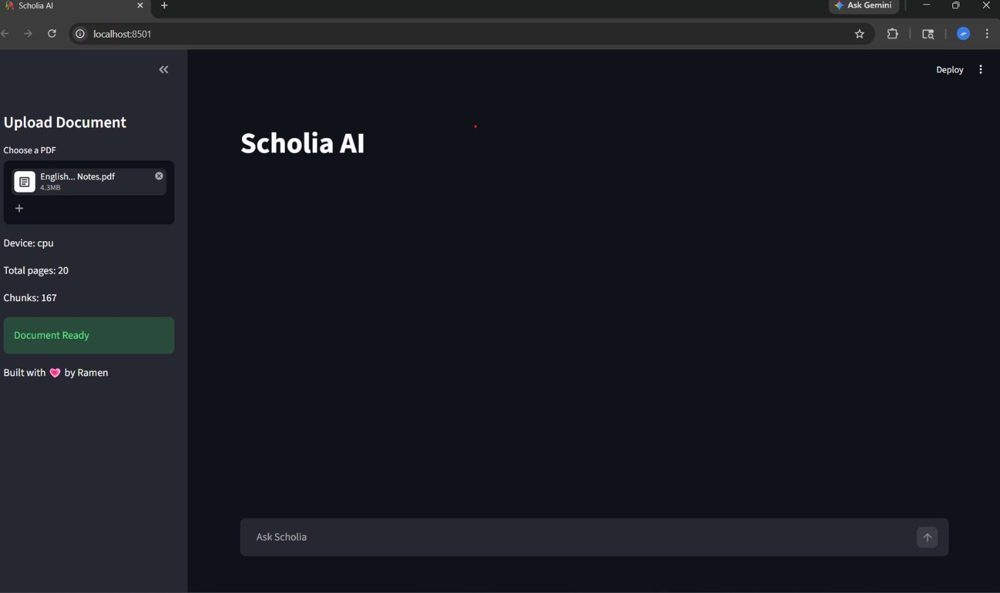

# modScholia

A modular Retrieval-Augmented Generation (RAG) system designed for scalable, context-aware document querying.

---


---

## Overview

modScholia enables grounded question answering over custom documents using hybrid retrieval and local LLM inference.

The system follows a modular architecture, allowing independent development, testing, and optimization of each component.

---

## UI Preview


---

## Architecture

```
Ingestion → Chunking → Vector Store (FAISS + BM25) → Hybrid Retrieval → Reranking → Pipeline → App
```

* Ingestion: Document loading and preprocessing
* Vector Store: Embedding storage using FAISS
* Retrieval: Context fetching via similarity search
* Pipeline: Orchestration of end-to-end flow
* App: Streamlit-based interface

---

## Project Structure

```
modScholia/
│── config/         
│── core/           
│── ingestion/      
│── retrieval/      
│── vectorstore/    
│── pipeline/       
│── utils/          
│── app.py          
│── requirements.txt
```

---

## Tech Stack

* Python
* FAISS (vector similarity search)
* BM25 (keyword-based retrieval)
* Ollama (llama3 local LLM)
* Streamlit (interface)
* Sentence Transformers (reranker + embeddings)

---

## Installation

```bash
git clone https://github.com/imramen07/modScholia.git
cd modScholia
pip install -r requirements.txt
```

Prerequisite: Ollama with the `llama3` model running locally.

---

## Usage

```bash
streamlit run app.py
```

---

## How It Works

1. Documents are ingested and preprocessed
2. Text is converted into embeddings and stored in FAISS
3. User query is processed through semantic embedding + keyword tokenization
4. Relevant documents are retrieved using hybrid search (FAISS semantic + BM25 keyword retrieval)
5. Retrieved documents are reranked using a cross-encoder reranker for improved relevance
6. Retrieved context and query are passed to the LLM
7. The generated response is returned through the interface

---

## Use Cases

* Educational assistants for querying notes and study material
* Internal knowledge bases for organizations
* Document question-answering systems
* Context aware chatbots grounded in data
* Semantic search over custom datasets

---

## Target Users

* Students exploring AI, ML, or NLP
* Developers building LLM-based applications
* Startups creating internal tools
* Researchers handling large document collections

---

## Features

* Modular RAG architecture
* Hybrid retrieval (FAISS + BM25)
* Cross-encoder reranking for improved accuracy
* Local LLM integration (no external API dependency)
* GPU-accelerated FAISS support
* Lightweight Streamlit interface

---

## System Design Goals

* Reduce hallucinations using retrieval grounding
* Improve recall via hybrid search
* Optimize relevance using reranking
* Keep inference fully local (privacy-first design)

---

## Performance Enhancements

* Hybrid search improves recall for both semantic and keyword queries
* Reranking improves final answer relevance
* GPU FAISS acceleration for faster retrieval on large document sets

---

## Example

Query:
What is retrieval-augmented generation?

Response:
Retrieval-Augmented Generation combines information retrieval with language models to produce context-grounded and accurate responses.

---

## Future Improvements

* Add FastAPI backend for production deployment
* Improve retrieval ranking and relevance
* Introduce evaluation metrics
* Add logging and monitoring

---

## Author

Ramen
GitHub: https://github.com/imramen07
